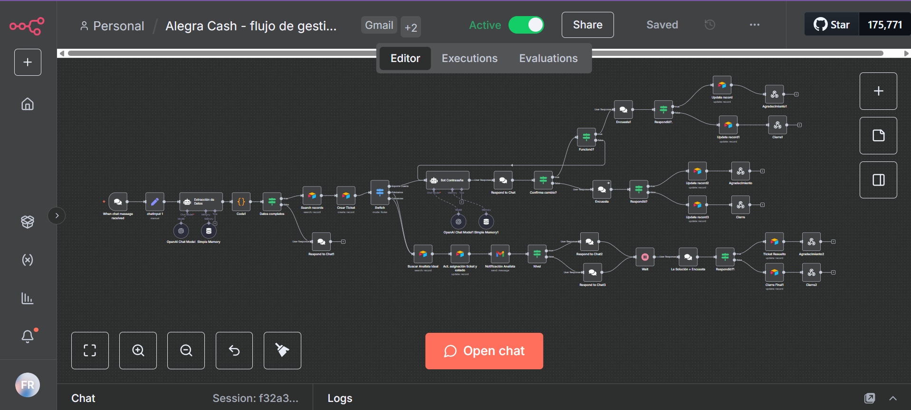

# 🤖 Fanny Rodriguez | AI Automation Lead

> Production-ready AI automation templates built with n8n, OpenAI, Airtable, Google APIs, and CRMs.  
> Plantillas de automatización listas para producción con n8n, OpenAI, Airtable, Google APIs y CRMs.

---

## ⚡ What this repository is

A curated portfolio of real-world AI automation workflows designed for enterprise use cases, including scheduling, CRM automation, onboarding pipelines, and AI tutoring systems.

📌 **Use this repository to:**
- Import production-ready n8n templates
- Learn enterprise automation architecture patterns
- Showcase AI automation projects in your portfolio

---

## 💡 Production Metrics (Real Impact)

> These templates are production-tested and scalable for enterprise automation pipelines.

- Processed **5k+ automation events/month**
- Reduced manual workload by **70–90%**
- Automated scheduling, CRM workflows, onboarding, and AI tutoring pipelines
- Built conversational AI agents for operations and education

---

## 🏢 Enterprise Use Cases

- Conversational AI agents for scheduling and CRM automation  
- Automated onboarding pipelines (MailerLite + Google Sheets)  
- AI tutoring agents with multimodal input (voice, text, images)  
- Financial and support automation workflows  

---

## 🚀 Projects | Proyectos

### 📂 Directorio de Soluciones | Solutions Directory

| Proyecto / Project | Función Principal | Demo / Captura | n8n Workflow |
| :--- | :--- | :---: | :---: |
| **📅 AI Calendar Agent** | Agendamiento inteligente vía Telegram | [Ver imagen](#-1-telegram-calendar-ai-agent-rag--google-calendar) | [📥 JSON](./calendar-bot/Agente%20telegram%20agendamiento%20calendar+%20RAG.json) |
| **📊 Ticket Manager** | Flujo de gestión de tickets y pagos | [Ver imagen](#-2-agente-gestión-de-ticket--support) | [📥 JSON](./agente-gestión-ticket/Alegra%20Cash-flujo%20de%20gestion%20conversacional.json) |
| **💼 CRM Manager** | Gestión conversacional en Kommo CRM | [Ver imagen](#-3-ai-crm-assistant-kommo) | [📥 JSON](./crm-gestion/Agente%20IA%20de%20Gestión%20CRM%20_kommo.json) |
| **🎓 Onboarding Académico** | Automatización de registro de alumnos | [Ver imagen](#-4-academic-onboarding-automation) | [📥 JSON](./onboarding/Onboarding%20Académico%20(1).json) |
| **🧑‍🏫 AI English Tutor** | Tutor multimodal (A1–B1) | [Ver imagen](#-5-ai-english-tutor-a1b1) | [📥 JSON](./tutor-de-ingles/Tutor%20ingles%20A1%20-%20B1.json) |

---

### 📅 1. Telegram Calendar AI Agent (RAG + Google Calendar)

**Problem | Problema:** Manual meeting scheduling wastes time and causes delays.  
**Solution | Solución:** Telegram AI agent integrated with Google Calendar and Retrieval-Augmented Generation (RAG).  
**Impact | Impacto:** ⏱️ 90% time saved in scheduling operations.

  <kbd>
    
  </kbd>

#### 📥 **Import Instructions | Importar en n8n**
1. **Download:** [Get JSON Workflow](./calendar-bot/Agente%20telegram%20agendamiento%20calendar+%20RAG.json)
2. **Import:** Open n8n > Import from file.
3. **Configure:** Set your API Keys in the nodes.

---

### 📊 2. Agente Gestión de Ticket + Support

**Problem | Problema:** Customer support routing and password recovery were manual.  
**Solution | Solución:** AI conversational agent that classifies requests, routes analysts, and guides users step-by-step.  
**Impact | Impacto:** ⚡ Faster support resolution and automated satisfaction surveys.

  <kbd>
    
  </kbd>

#### 📥 **Import Instructions | Importar en n8n**
1. **Download:** [Get JSON Workflow](./agente-gestión-ticket/Alegra%20Cash-flujo%20de%20gestion%20conversacional.json)
2. **Import:** Open n8n > Import from file.
3. **Configure:** Set your API Keys in the nodes.

---

### 📈 3. AI CRM Assistant (Kommo)

**Problem | Problema:** Leads and client conversations required manual follow-up.  
**Solution | Solución:** AI agent integrated with Kommo CRM for conversational lead qualification and meeting automation.  
**Impact | Impacto:** 🤝 Improved lead qualification and automated sales funnel.

  <kbd>
    
  </kbd>

#### 📥 **Import Instructions | Importar en n8n**
1. **Download:** [Get JSON Workflow](./crm-gestion/Agente%20IA%20de%20Gestión%20CRM%20_kommo.json)
2. **Import:** Open n8n > Import from file.
3. **Configure:** Set your API Keys in the nodes.

[Ver imagen](#-3-ai-crm-assistant--kommo) |

---

### 🎓 4. Academic Onboarding Automation

**Problem | Problema:** Student onboarding and tracking were manual.  
**Solution | Solución:** Automated MailerLite subscription + Google Sheets database + academic segmentation.  
**Impact | Impacto:** 📊 Centralized onboarding data for analytics and dashboards.

  <kbd>
    
  </kbd>

#### 📥 **Import Instructions | Importar en n8n**
1. **Download:** [Get JSON Workflow](./onboarding/Onboarding%20Académico%20(1).json)
2. **Import:** Open n8n > Import from file.
3. **Configure:** Set your API Keys in the nodes.

---

### 🧑‍🏫 5. AI English Tutor (A1–B1)

**Problem | Problema:** Personalized tutoring required manual teacher interaction.  
**Solution | Solución:** Telegram AI tutor with multimodal input (text, voice, image) using OpenAI.  
**Impact | Impacto:** 📚 Scalable AI tutoring system for beginner English learners.

  <kbd>
    
  </kbd>

#### 📥 **Import Instructions | Importar en n8n**
1. **Download:** [Get JSON Workflow](./tutor-de-ingles/Tutor%20ingles%20A1%20-%20B1.json)
2. **Import:** Open n8n > Import from file.
3. **Configure:** Set your API Keys in the nodes.

---

## 📦 Templates Overview

| Template | Use Case | Tech |
|----------|-----------|------|
| Calendar AI Agent | Meeting scheduling automation | Telegram, Google Calendar, OpenAI |
| Alegra Support Agent | Customer support automation | OpenAI, Webhooks |
| Kommo CRM AI Agent | Lead qualification automation | Kommo, OpenAI |
| Academic Onboarding | Student onboarding | MailerLite, Google Sheets |
| AI English Tutor | AI tutoring system | Telegram, OpenAI Vision & Speech |

---

## ⚙️ Quick Start

1. Download any `workflow.json`
2. Open n8n
3. Go to **Import → From File**
4. Configure credentials (OpenAI, Google, Telegram, etc.)
5. Run and customize

> All templates are modular and environment-agnostic.

---

## 🧠 Tech Stack | Stack Tecnológico

| Tool | Use Case |
|------|-----------|
| n8n | Workflow orchestration |
| OpenAI | AI Agents, NLP, Vision, Speech |
| Airtable | CRM & knowledge base |
| Supabase | Backend storage |
| Google Calendar | Scheduling automation |
| MailerLite | Email automation |
| Telegram API | Conversational interface |
| Kommo CRM | Lead management |

---

## 🔒 Security Notice

All API keys, tokens, and credentials have been removed.  
Replace placeholders like `YOUR_API_KEY_HERE` with your own secrets.

**Never commit production credentials to public repositories.**

---

## 👩‍💻 About Me | Sobre mí

**Fanny Rodriguez**  
AI Automation Lead & Consultant  
📧 fann.rods@gmail.com  

I design and deploy scalable AI automation systems for operations, sales, and education pipelines.  
Construyo sistemas de automatización con IA para operaciones, ventas y educación.

> Focus: AI agents, workflow orchestration, and enterprise automation architectures.

---

## 🧩 Keywords

n8n, AI automation, OpenAI agents, workflow orchestration, RAG, conversational AI, CRM automation, enterprise automation, AI pipelines, low-code automation

---

## 📄 License

MIT License. Feel free to use, modify, and share.

---

## ⭐ Support

If this repo helped you, give it a ⭐ and share it.  
Si te sirvió, dale una estrella y compártelo.